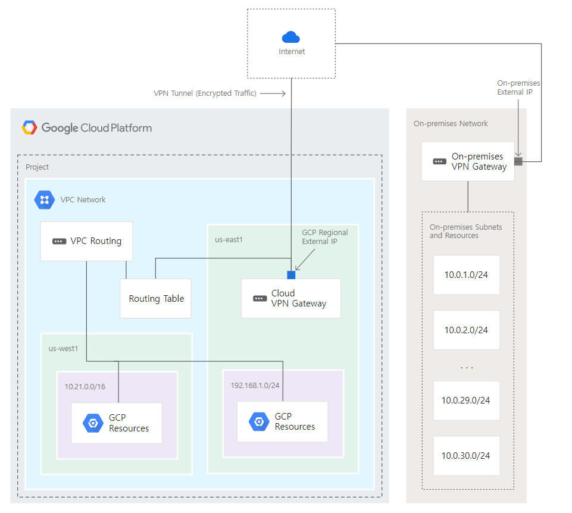
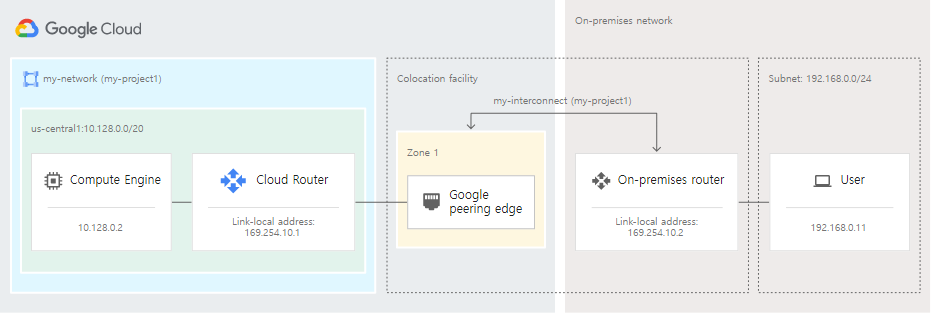
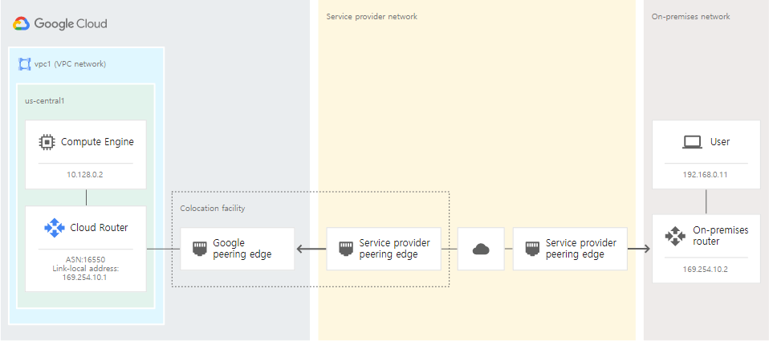

# GCP PCA(Professional-Cloud-Architect) 

## 관련 용어 정리
- CRM 
    - 고객 관계관리 
    - 현재 고객 및 잠재 고객과 관련된 정보를 관리/추적/저장 

<br>

# Storage & Database Resource

##  Storage & Database 시나리오

|서비스|시나리오|
|:-:|:-:|
|Cloud SQL|OLTP(온라인 트랜잭션 처리) 시스템에 전체 SQL 지원을 제공하는 관계형 데이터베이스가 필요한 경우|
|Cloud Bigtable|ACID 트랜잭션을 위한 지원이 필요하지 않거나 데이터의 구조화 수준이 높지 않은 경우|
|BigQuery|OLAP(온라인 분석 처리) 시스템을 위해 양방향 쿼리가 필요한 경우|
|Cloud Storage|대용량 이미지 또는 영화와 같이 변하지 않는 대용량 blob을 저장해야 하는 경우|

<br>

## Cloud Storage 
- 비정형 데이터를 저장하기 위한 관리형 서비스
- 오브젝트의 버전 관리 기능 제공

### Cloud Storage 관련 도구 
- gsutil 
    - 업로드 및 다운로드 지원 (cp/mv/gsync) 

- gcsfuse
    - Cloud Storage를 NFS 형태로 마운트 지원

### Cloud Storage 클래스 
- 클래스는 언제든지 변경이 가능

|Class|용도|
|:-:|:-:|
|Autoclass|- 객체 수준 활동을 기준으로 각 객체를 Standard 또는 Nearline 클래스로 자동 전환<br>- 사용 빈도를 예측할 수 없는 경우 권장|
|Standard|단기 스토리지 및 자주 액세스하는 데이터에 적합|
|Nearline|백업 및 월 1회 미만 액세스하는 데이터에 적합|
|Coldline|재해 복구 및 분기당 1회 미만 액세스하는 데이터에 적합|
|Archive|연 1회 미만 액세스하는 데이터의 디지털 장기 보존에 적합|

### Transfer Appliance
- 사용자 데이터를 Cloud Storage에 업로드하는 Google 업로드 시설로 데이터를 전송하고 안전하게 배송할 수 있도록 하는 대용량 스토리지 기기

- Cloud Storage에 대량데이터를 업로드 하는경우 사용

- 작동 방식
    - GCP에서 기기를 대여 > NFS형태로 마운트하여 데이터 복사 > GCP에 반환 > Cloud Storage에 업로드

<br>

## Cloud SQL 
- 완전관리형 SQL 서버  
- MySQL, PostgreSQL, SQL Server를 위한 완전 관리형의 관계형 데이터베이스 서비스
  
- 주요 특징 
    - 완전 관리형
    - 개방형 및 표준 기반
    - 높은 비용 효율성
    - 생성형 AI 지원
    - 간편한 마이그레이션

<br>

## Cloud DataStore (Firestore)
- 자동 확장, 고성능, 간편한 애플리케이션 개발을 위해 빌드된 NoSQL 문서 중심의 데이터베이스

- 현재 최신버전의 Datastore인 Firestore로 업그레이드됨.

- 주요 특징
    - 테이블이나 행이없고 컬렉션으로 정리되는 문서에 데이터 저장 
    - 모든 문서는 컬렉션에 저장되어야 함
    - 각 문서에는 키-값 쌍이 포함됨

>ex
```js
* users (Collection)
    - alovelace (class)
        first : "Ada"
        last : "Lovelace"
        born : 1815
    - aturing (class)
        first : "Alan"
        last : "Turing"
        born : 1912
```

<br>

## Big Table / Big Query

### Big Table
- 대규모 분석 및 운영 워크로드를 위한 확장 가능한 완전 관리형 NoSQL 데이터베이스 서비스
- NoSQL 와이드 컬럼 데이터베이스

- 특징 
    - 짧은 대기 시간, 많은 수의 읽기 및 쓰기, 대규모 성능 유지에 최적화
    - 읽기 및 쓰기 측면에서 크게 확장해야 하는 애플리케이션을 만들 때 사용
    - Bigtable 처리량은 노드를 추가/제거하여 조정가능.
        -   각 노드는 초당 최대 10,000개의 쿼리 (읽기 및 쓰기)를 제공
    - Hadoop, Dataflow 및 Dataproc과 같은 기존 빅 데이터 도구와 쉽게 통합 가능

### Big Query 
- 대량의 관계형 구조화된 데이터를 위한 엔터프라이즈 데이터 웨어하우스
- 데이터를 쉽게 수집, 저장, 분석, 시각화하도록 설계된 페타바이트 규모의 데이터 웨어하우스

- 특징 
    - 대규모 임시 SQL 기반 분석 및 보고에 최적화
    - BigQuery를 사용하여 Cloud Bigtable의 데이터를 분석 가능
    - 일반적인 BigQuery 사용 사례에는 대규모 저장 및 분석 또는 OLAP(온라인 분석 처리)가 포함

- 명령어     
- `bq show` : 모든 job 확인 가능
- `bq ls`  : 각 job의 정보 확인 가능


## Dataproc
완전 관리형의 자동화된 빅데이터 오픈소스 소프트웨어
 - Apache Hadoop, Apache Spark, Apache Flink, Presto, 30개 이상의 오픈소스 도구 및 프레임워크 제공


<br>

## Cloud Data Loss Prevention(Cloud DLP)
- 개인 식별 정보(PII)와 같은 민감한 정보를 대규모로 식별하고 보호할 수 있는 Google Cloud의 완전 관리형 서비스

- Cloud Storage, Datastore, BigQuery를 스캔하여 민감 정보를 감지하고, 해당 정보의 저장 위치와 데이터의 유형, 사용되는 방법을 식별 가능

- 조직 전반에서 Cloud DLP 검사를 지속적으로 실행 시, BigQuery에 새 테이블 데이터가 추가될 때 자동으로 데이터 프로파일링을 실행
    

- Cloud DLP의 사전 정의된 감지기
    - 별도 프로그래밍을 통한 로직 작성 없이 민감 정보의 패턴, 형식 등을 식별 가능
    - 데이터의 복제 없이도 마스킹, 토큰화, 가명처리 등의 데이터 익명화 가능

<br>


# Compute Resource

## Anthos 
-  Google의 클라우드 중심 컨테이너 플랫폼     

-  퍼블릭 클라우드와 온프레미스 모두에 걸친 여러 환경의 Kubernetes 클러스터를 관리하고 정책을 일관성 있게 적용 가능

- AWS나 애져(Azure) 같은 서드파티 클라우드에서 구동하는 워크로드도 관리 가능

### Anthos Service mesh
- Google에서 구현한 Istio 오픈소스 프로젝트

- 마이크로 서비스를 위한 어플리케이션에 구축된 인프라 계층

- Application 코드를 변경하지 않고도 서비스를 관리, 관찰, 보호 가능

- 트래픽 관리에서 메시 원격 분석, 서비스 간 통신 보안까지 모든 면에서 서비스 제공을 간소화
    - 운영 및 개발팀의 부담 감소

- 모니터링, 네트워킹, 보안과 같은 서비스 실행과 관련된 일반적인 문제를 모두 고려
    - 서비스 간의 통신을 제어, 표시, 관리

<br>


## Stackdriver
- Google Cloud 내부와 외부에서 실행되는 애플리케이션 및 시스템에 대한 통합 모니터링, 로깅, trace 관리형 서비스

- 특징 
    - 로그관리 
        - 모든 로그는 Cloud Logging API로 전송되어 로그라우터를 통과

    - 실시간 로그 관리 및 분석
        - BigQuery를 통해 분석 가능 

    - 대규모 측정항목 관측 가능성 기본 제공
        - Cloud Monitoring을 통해 측정내용 확인 가능 

    - Prometheus를 실행하고 확장하기 위한 독립형 관리형 서비스 
        - Managed Service for Prometheus

    - 애플리케이션 성능 모니터링 및 개선 (APM)
        -  Cloud Trace(지연시간관리) 및 Cloud Profiler(성능 및 비용관리)와 결합 가능


<br>


## Instance Group 
- 관리형과 비관리형으로 구분

### 비관리형 인스턴스 그룹
- 다수의 인스턴스를 논리적으로 그룹화 한 것
- 로드밸런서로 연결가능해짐

### 관리형 인스턴스 그룹 (MIG)
- 고가용성
    - 실패한 VM 자동 복구 ( VM 중지/충돌/선점/삭제 시 재생성 )
    - 애플리케이션 기반 자동 복구 ( Application 체크 및 미응답시 VM 재생성)
    - 리전(멀티 영역) 노출 범위 (앱 부하 분산 가능)
    - 부하 분산 ( 트래픽 분산 )

- 확장성
    - 인스턴스 오토스케일링 지원

- 자동 업데이트
    - 새로운 버전의 소프트웨어를 MIG에 배포가능 
        - 순차적,카나리아 등의 업데이트 옵션 지원

- 스테이트풀(Stateful) 워크로드 지원
    - Stateful 구성을 사용하는 Application의 배포 빌드 및 작업  자동화 가능


### MIG Update 유형
#### Proactive Update Mode - 자동(사전형)
- 업데이트 할 구성을 VM에 자동으로 적용 
- 지정된 개수의 인스턴스를 중지 후, 신규 인스턴스를 띄워서 교체를 지원하는 형태

#### Opportunistic Update Mode - 선택적(상황별)
- 업데이트를 바로 진행하지 않고 수동으로 교체/새로고침/다시 시작 시 VM 업데이트를 진행

#### Canary updates
- 그룹의 인스턴스 하위 집합에 적용되는 업데이트

- 중단을 유발할 수 있는 업데이트를 모든 인스턴스에 출시하는 대신 인스턴스의 임의 하위 집합에서 업그레이드를 테스트 가능

- 업데이트가 잘 진행되지 않는 경우 인스턴스의 하위 집합만 롤백하면 사용자 작업 중단을 최소화

- 업데이트해야 하는 인스턴스 수가 인스턴스 그룹의 전체 크기보다 적음

- 추가 옵션을 구성하여 서비스에 대한 장애 수준을 제어가능

<br>


# Netowrk Resource

## Shared VPC / VPC Peering

### Shared VPC
- 여러 프로젝트가 공유해서 사용할 수 있는 VPC network

- 프로젝트 하나를 호스트 프로젝트로 지정하고 여기에 하나이상의 다른 서비스프로젝트를 연결하여 호스트 프로젝트의 VPC 네트워크를 공유
    - 호스트 프로젝트의 VPC를 다른 프로젝트에서 사용가능하도록 하는것 

- Shared VPC는 동일 조직내의 프로젝트만 연결 가능
    - GCP의 경우 서로 다른 organization이 VPC를 공유하는 것은 불가능하고 같은 organization 하위의 프로젝트들은 VPC를 공유 가능

    - 연결된 프로젝트는 다른폴더에 존재가능 
        - 폴더가 다른 경우 관리자가 두 폴더에 대한 공유 VPC 권한 소유해야함

- Shared VPC에 사용가능한 리소스 
    - IP 주소 
    - 내부 DNS 
    - 부하 분산

### VPC Peering
- 2개의 Virtual Private Cloud(VPC) 네트워크를 연결하여 각 네트워크의 리소스가 통신 가능하도록 하는 역할

- 서로 다른 organization, project의 VPC 네트워크라도 public 을 거치지 않고 통신 가능하게 해줌

- 내부 통신을 가능하게 해줌으로써 다음과 같은 이득을 얻을 수 있음
    - Low latency : 내부연결은 외부 연결보다 지연시간 짧음
    - Security : 공개 인터넷에 서비스를 노출할 필요가 없어 리스크 감소
    - 비용 측면 : 외부IP 사용시 Egress 비용 청구됨 

- 조건
    - 하나의 VPC 네트워크에 여러 개의 VPC 네트워크를 피어링할 수 있지만 제한 존재
    - 각 VPC 별로 Peering 설정해주어야함
        - 하나의 VPC만 설정하면 연결 x 
    - 피어링된 VPC 네트워크의 서브넷 IP 범위는 겹칠 수 없다

- 3개의 VPC를 연결하는 경우 
    ```
    A <-- peering --> B  <-- peering --> C
    ```
    - 다음 형태로 연결된 VPC의 경우 A 와 C에대한 연결을 따로 지정하지 않으면 통신 불가

<br>

## Cloud VPN / Cloud Interconnect 
- GCP VPC를 On-Premise의 네트워크와 연결해야 하는 경우 사용됨.

- `Cloud VPN / Cloud Interconnect 비교` 
    |Cloud VPN |Cloud Interconnect |
    |:-:|:-:|
    |- 보안데이터 전송<br>- 처리량이 낮은 솔루션<br>- 원격 엑세스 가능해야함<br>- 공용인터넷에 접속이 필요|- 빠른 연결 속도와 낮은 대기 시간 필요<br>- 트래픽이 공개 인터넷을 통하지 않아야 하는경우<br>- 비공개 액세스가 필요한경우|


### Cloud VPN


- VPN Tunnel을 통해 온프레미스 네트워크와 연결 제공
- 안전한 전송을 보장하기 위해 공용 인터넷을 통해 데이터를 암호화
- 보안데이터 전송 , 처리량이 낮은 솔루션, 원격 엑세스, 공용인터넷에 접속 등이 필요한경우 사용 

- 기본 VPN과 HA VPN 제공 
    - HA VPN 
        - 99.99% 서비스 가용성의 SLA를 제공
        - 두개의 터널로 연결

### Cloud Interconnect 

- 매우 빠른 연결 속도와 낮은 대기 시간이 필요
- 트래픽이 공개 인터넷을 통하지 않아야 하는경우 
- 온프레미스 리소스에서 GCP 리소스에 대한 비공개 액세스가 필요한경우
    - 비공개로 유지되는 물리적 연결 제공
- Dedicate Interconnect와 Partner Interconnect로 구분

#### Dedicate Interconnect


- 온 프레미스 네트워크와 Google 네트워크 간의 직접적인 물리적 연결을 제공


#### Partner Interconnect


- 지원되는 서비스 제공 업체를 통해 온 프레미스 네트워크와 VPC 네트워크 간의 연결을 제공
    - 서비스 제공 업체와 협력하여 VPC와 온 프레미스 네트워크를 연결
